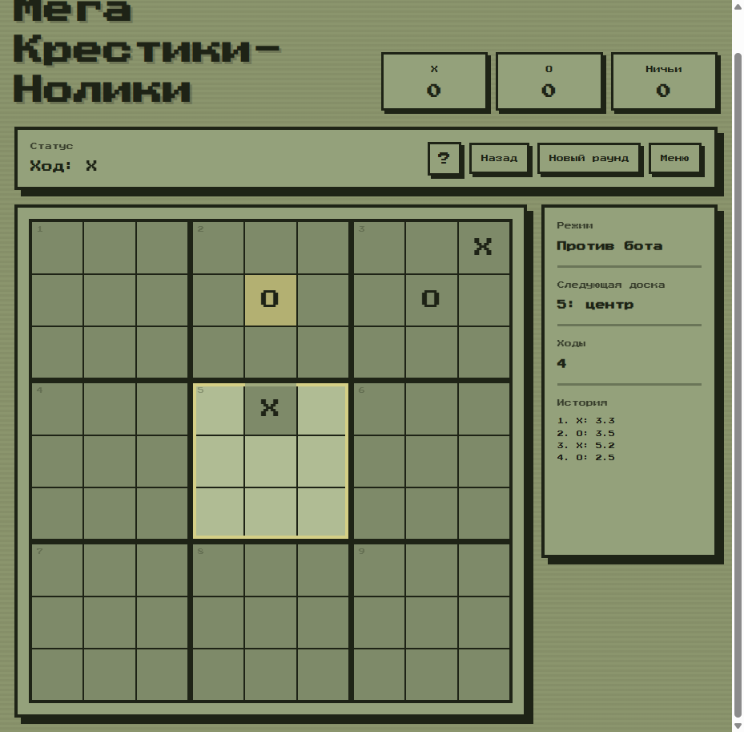

# Mega Tic-Tac-Toe

Ретро-версия **Ultimate Tic-Tac-Toe** на чистых **HTML, CSS и JavaScript**. Это не просто обычные крестики-нолики: каждый ход отправляет соперника на конкретную малую доску, а победа в малой доске захватывает большой квадрат.



## Возможности

- режим **2 игрока** на одном устройстве;
- режим **против бота**;
- полноценная логика Ultimate Tic-Tac-Toe;
- подсветка доски, на которой разрешён ход;
- захват малых досок и определение глобального победителя;
- счёт между раундами;
- история ходов;
- отмена хода;
- окно с правилами;
- ретро-звуки через Web Audio API;
- адаптивный интерфейс для компьютера и телефона.

## Как играть

1. Игровое поле состоит из 9 малых досок 3x3.
2. Клетка, в которую сделан ход, определяет большую доску для следующего игрока.
3. Если игрок выигрывает малую доску, он захватывает соответствующий большой квадрат.
4. Если нужная большая доска уже завершена, можно ходить в любую доступную доску.
5. Побеждает тот, кто первым соберёт 3 захваченных больших квадрата в ряд.

## Запуск

Проект не требует сборки и зависимостей.

Откройте `index.html` в браузере или запустите локальный сервер:

```powershell
python -m http.server 8080
```

Затем откройте:

```text
http://localhost:8080
```

## Структура проекта

```text
.
├── index.html      # Разметка экранов игры
├── style.css       # Ретро-оформление и адаптивность
├── script.js       # Игровая логика, бот, звук, история ходов
└── README.md       # Описание проекта
```

## Технологии

- HTML5
- CSS3
- Vanilla JavaScript
- Web Audio API

## Автор

Проект подготовлен для репозитория [M0thM4trix/TIC-TAC-TOE](https://github.com/M0thM4trix/TIC-TAC-TOE).
